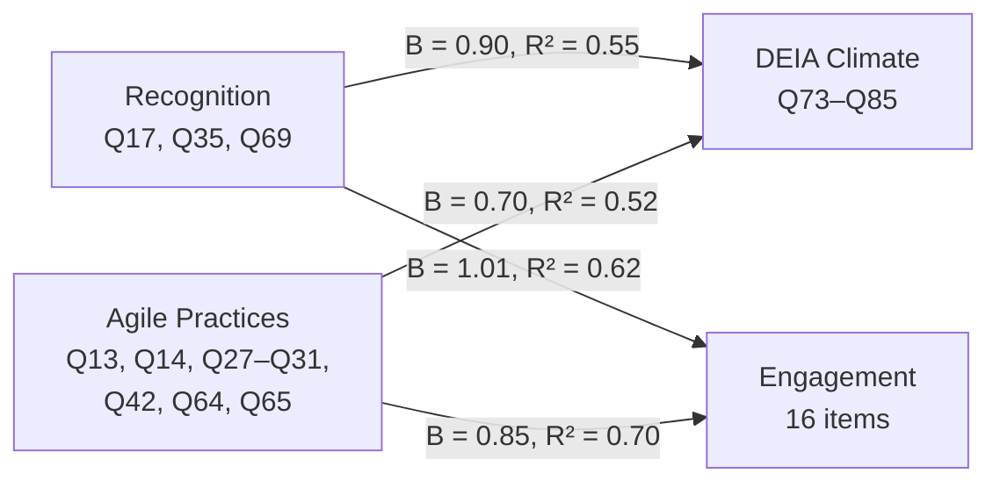

```mermaid
flowchart LR
    REC[Recognition<br/>Q17, Q35, Q69]
    DEIA[DEIA Climate<br/>Q73–Q85]
    AGI[Agile Practices<br/>Q13, Q14, Q27–Q31,<br/>Q42, Q64, Q65]
    ENG[Engagement<br/>16 items]

    REC -->|B = 0.90, R² = 0.55| DEIA
    AGI -->|B = 0.70, R² = 0.52| DEIA
    REC -->|B = 1.01, R² = 0.62| ENG
    AGI -->|B = 0.85, R² = 0.70| ENG
```
# DEIA-Recognition-and-Engagement-at-the-NSF
A regression analysis of National Science Foundation employees, using the 2023 Federal Employee Viewpoint Survey (FEVS).
